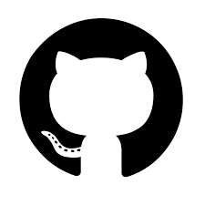

<!--https://media0.giphy.com/media/2IudUHdI075HL02Pkk/giphy.gif?cid=ecf05e47zfvkx09jcvinzxgzu1k5u3hq0c8451bqf8w70uub&ep=v1_gifs_search&rid=giphy.gif&ct=g-->

<h1 align="center">{ &nbsp; Rômulo "Cypher" Moraes &nbsp; }</h1>

Hello, my name is Rômulo Peres de Moraes, but my nickname is Cypher, i just guess this nickname canny, you know. i'm a computer enthusiast and my focus in
this area is to learn how the computer works. I like video games, skateboarding and listen music. Currently my
favorite programming language is C, for me there is no thing more powerful than it.

<h1>Some good repositories that you could like</h1>

   
   
    
   
   

<h2>R-matrix 💻</h2>
This is a application for terminal written in Rust that simulates a matrix on screen with customization features, the matrix's characters
and background can have their colors changed. There're also costumizations for the application's behaviors, you can change the delay that new chain 
of characters are created on screen and how quick such chains are pulled down to generate the matrix effect. This project
already existed written in the C programming language, however, was used by me to learn a bit more about Rust.

<h2>Rclock 🕐</h2>
The Rclock is a digital terminal clock for POSIX systems, fully customizable with colors and datetime features.
This repository is fully documented, for final users and for developers that may create new features or for maintenance reasons.
the included features of the Rclock are change the color of the components, optionally hide the date and the seconds, set a custom date and so on...

<h2>Anemone 🐟</h2>
Anemone is a small library written in C for C programming language that has the final goal of be a command-line
argument parser, working currently with positional arguments and optional arguments. The project contains the 
whole documentation in the main README.md file and in some issues with the label 'documentation'.

<h2>Assembly-Toolkit ⚙️</h2>
This repository is a project that contains the basic knowledge about the Assembly language, the necessary runway to take
off when the subject is the low-level coding. This repository covers things about memory segments, stack, registers, opcodes
and more. Assembly language is really tough, even more whether you never saw a code with this tool, but with the help of the sections
that are inside the Assembly-Toolkit the things may be easier.

<h1>My status 📖</h1>

   
   

### My tools

   
   
   
   

### My computer languages

   <!---->
   
   
   
   
   

### My human languages
<ul>
   <li>Portuguese 🇧🇷</li>
   <li>English 🇺🇸</li>
</ul>

### My operating system

   &nbsp;&nbsp;&nbsp;&nbsp;&nbsp;&nbsp;&nbsp;&nbsp;&nbsp;&nbsp;&nbsp;&nbsp;&nbsp;
      
   
&nbsp;&nbsp;&nbsp;&nbsp;&nbsp;&nbsp;&nbsp;Arch Linux (btw)

<!--
    ------------------
   //     _____      \\
  //     |  __ \      \\
 //      | |__) |      \\
//       |  _  /        \\
\\       | | \ \        //
 \\      |_|  \_\      //
  \\    __________    //
   \\                //
   --------------------
   | Rômulo P. Moraes |
   -------------------
-->
